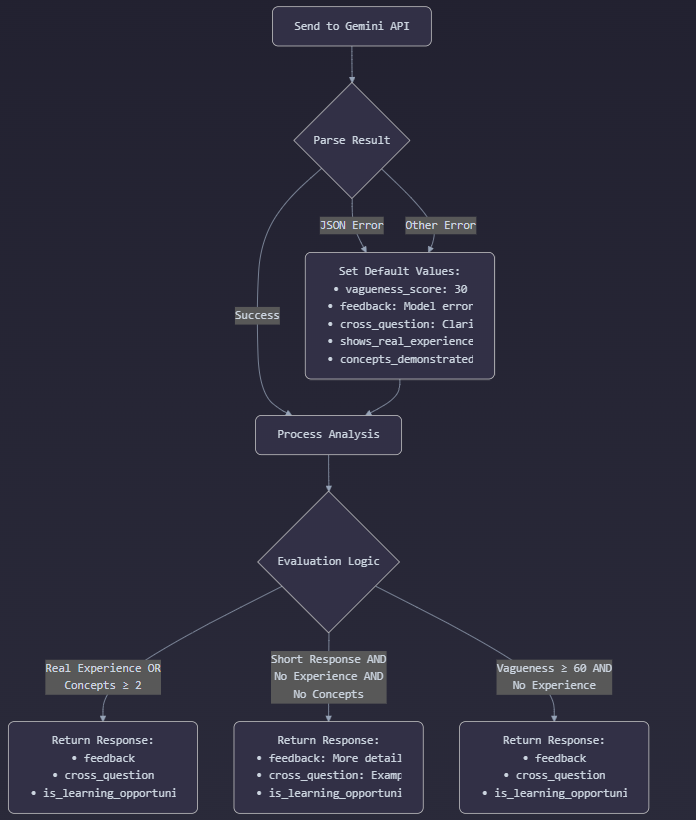

# AI Interview Assistant

An intelligent interview practice application that helps users prepare for technical, behavioral, and system design interviews with real-time AI feedback.


### Watch video demo
[](https://www.youtube.com/watch?v=4XKOvQIDlOQ)

## Features

- **Multi-format Interview Practice**: Choose from Technical, Behavioral, System Design, Problem Solving, Leadership, HR, and Case Study interviews.
- **AI-generated Questions**: Dynamic generation of relevant interview questions based on the selected category.
- **Real-time Feedback**: Receive immediate analysis and feedback on your responses.
- **Learning Opportunities**: Get detailed explanations when you're unfamiliar with a topic.
- **Progress Tracking**: Track your progress with a question counter.
- **Detailed PDF Reports**: Download comprehensive feedback summaries in PDF format.

## How It Works

The AI Interview Assistant uses a sophisticated AI-powered approach to simulate realistic interview experiences.



### Key Components:

1. **Question Generation**: The system uses Google's Gemini AI to generate contextually relevant interview questions based on the selected category (Technical, Behavioral, etc.).

2. **Response Analysis**: When you answer a question, the AI evaluates your response based on several criteria:
   - Technical accuracy
   - Demonstrated real-world experience
   - Problem-solving approach
   - Communication clarity
   
3. **Adaptive Follow-up**: The system dynamically adjusts based on your answers:
   - For strong answers: Provides positive feedback and challenging follow-up questions
   - For vague or incomplete answers: Offers constructive criticism and suggestions
   - For "I don't know" responses: Provides learning resources and explanations
   
4. **Comprehensive Feedback**: Upon completion, the AI analyzes your entire interview performance and generates:
   - Overall assessment (Accepted/Rejected)
   - Strengths and weaknesses
   - Detailed feedback for each question
   - Specific improvement suggestions
   
5. **PDF Report Generation**: All feedback is compiled into a professional PDF report you can download for later review.

## Tech Stack

### Frontend
- React with TypeScript
- Tailwind CSS for styling
- React Context API for state management
- Axios for API requests

### Backend
- Django REST Framework
- Gemini API for AI question generation and response analysis
- JWT Authentication
- ReportLab for PDF generation

## Getting Started

### Prerequisites
- Python 3.9+
- Google API key for Gemini AI

### Installation

#### Backend Setup
1. Clone the repository:
   ```
   git clone https://github.com/yourusername/ai-interview.git
   cd ai-interview
   ```

2. Create and activate a virtual environment:
   ```
   cd backend
   python -m venv venv
   # Windows
   venv\Scripts\activate
   # Linux/Mac
   source venv/bin/activate
   ```

3. Install dependencies:
   ```
   pip install -r requirements.txt
   ```

4. Run migrations:
   ```
   python manage.py migrate
   ```

5. Create a `.env` file in the backend directory with your Gemini API key:
   ```
   GEMINI_API_KEY=your_gemini_api_key
   ```

6. Start the backend server:
   ```
   python manage.py runserver
   ```

#### Frontend Setup
1. Navigate to the frontend directory:
   ```
   cd frontend
   ```

2. Install dependencies:
   ```
   npm install
   ```

3. Start the development server:
   ```
   npm run dev
   ```

4. Open your browser and go to `http://localhost:5173`

## Usage

1. **Register/Login**: Create an account or log in to get started.
2. **Select Interview Type**: Choose the type of interview you want to practice.
3. **Answer Questions**: Respond to the AI-generated questions.
4. **Receive Feedback**: Get real-time feedback on your responses.
5. **Continue or Review**: Proceed to the next question or review your performance.
6. **Download Report**: Once the interview is complete, download a detailed PDF report.

## Project Structure

```
ai-interview/
├── backend/
│   ├── ai_agent/                # Django project settings
│   ├── apps/
│   │   ├── authentication/      # User authentication
│   │   ├── interviews/          # Interview logic and API
│   │       ├── services/        # AI services integration
│   │       ├── utils.py         # Utility functions (PDF generation)
│   │       ├── views.py         # API endpoints
│   │       └── models.py        # Database models
│   └── manage.py
├── frontend/
│   ├── src/
│   │   ├── components/          # React components
│   │   ├── context/             # React context providers
│   │   ├── services/            # API service functions
│   │   ├── types/               # TypeScript type definitions
│   │   └── App.tsx              # Main application component
│   ├── package.json
│   └── vite.config.ts
└── README.md
```

## API Endpoints

- `POST /api/auth/register/`: User registration
- `POST /api/auth/login/`: User login
- `POST /api/interviews/generate-questions/`: Generate interview questions
- `GET /api/interviews/sessions/{session_id}/next-question/{current_order}/`: Get next question
- `POST /api/interviews/submit-response/{session_id}/{question_id}/`: Submit response to a question
- `POST /api/interviews/sessions/{session_id}/feedback/`: Get interview feedback
- `GET /api/interviews/sessions/{session_id}/feedback/pdf/`: Download feedback as PDF

## Contributing

Contributions are welcome! Please feel free to submit a Pull Request.

1. Fork the repository
2. Create your feature branch (`git checkout -b feature/amazing-feature`)
3. Commit your changes (`git commit -m 'Add some amazing feature'`)
4. Push to the branch (`git push origin feature/amazing-feature`)
5. Open a Pull Request


## Acknowledgments

- Google Gemini API for powering the AI capabilities
- Django REST Framework for the backend API
- React and Tailwind CSS for the frontend 